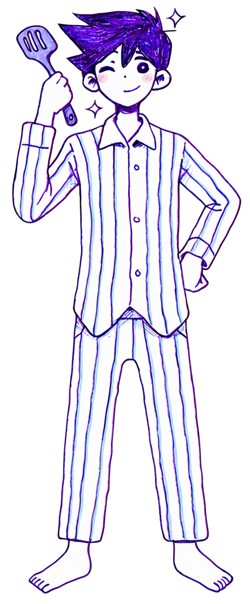

# 👋 Hello! I'm Bernardo Lemos

### Computer Science Student • 2D Indie Game Developer in My Free Time

📍 Porto Alegre, Brazil

---

## 👨‍💻 About Me

<table>
<tr>
<td width="70%">

- 🎓 Computer Science undergraduate student
- 🎮 I develop 2D indie games in my free time
- 💻 IT Technician specialized in Internet Computing
- 🛠️ Currently working as an IT Support Intern
- 🕹️ Enthusiastic about game development and interactive experiences
- 🥽 Interested in virtual reality development
- ⚙️ Passionate about creating physics simulators
- 🔌 Experience with Arduino and physical computing projects
- 📚 Expanding my knowledge of Python, Java, C#, GameMaker Studio, Unity, and Arduino

</td>

<td width="30%" align="center">

</td>
</tr>
</table>

---

## 🚀 Technologies and Tools

&nbsp;

&nbsp;

&nbsp;

&nbsp;

&nbsp;

&nbsp;

&nbsp;

&nbsp;

---

## 🧠 My Interests

<table>
<tr>
<td width="40%" align="center">

</td>

<td width="60%">

- 🎮 Game Development
- 🥽 Virtual Reality
- ⚙️ Physics Simulations
- 🤖 Artificial Intelligence
- 🔌 Arduino and Physical Computing
- 💻 Software Development

</td>
</tr>
</table>

---

## 🐭 Featured Project: TrapMotion

**TrapMotion** is a Python-based physics simulator for designing and analyzing mousetrap-powered cars.

The simulator analyzes:

- wheel and axle geometry;
- spring torque and elastic energy;
- force transmission;
- vehicle mass and acceleration;
- rolling resistance;
- wheel grip and traction limits.

---

## 📫 Contact Me

---

### Thanks for visiting my profile! 🚀

